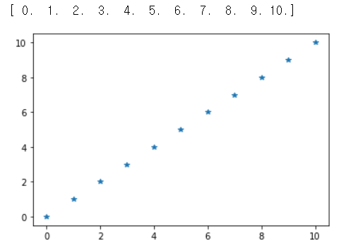

# 머신러닝, 딥러닝

## - Numpy


먼저 아나콘다를 실행시키고 초창기에 만들어두었던 가상환경 data_env로 가서 jupyter noteboook을 실행시키자.


### Numpy

python의 numpy module은 Vector와 Matrix연산에 있어서 상당한 편리성을 제공하는 모듈, 머신러닝과 딥러닝에 기반이 되는 모듈이다. 먼저 설치부터 해주자

anaconda에서 `conda install numpy`명령어를 이용하여 깔아주자.

python의 대표적인 데이터타입(자료구조)

- list, tuple, range, dict, set

하지만 numpy는 새로운 데이터타입을 하나 이용한다.

**ndarray(n-dimensional array)**

- python의 list와 상당히 유사하게 생겼다.
- list는 [1, True, 'Hello', 3.14]와 같이 각기 다른 데이터 타입을 저장할 수 있었지만 numpy는 아니다.
- 동일한 데이터 타입만 사용할 수 있다.
- list와 유사하지만 계산 속도면에서는 비교가 불가능할 정도로 ndarray가 빠르고 효율적이다.

한번 사용해보자.

`import numpy as np`

줄임말을 사용하기 위해 np라는 엘리아싱을 했는데 전세계적으로 np라는 키워드를 사용하니 따르자. 리스트와 비교하여 실습해보자.

```python
import numpy as np

a = [1, 2, 3, 4]
# []를 사용하고 원소의 구분을 ,로 한다.
print(type(a))
print(a)
print(type(a[0]))
b = np.array([1, 2, 3, 4])
# 우리가 알고 있는 리스트형태를 가지고 만든다.
# ndarray를 만들어내는 가장 대표적인 방법.
# 요소의 구분을 space로 한다.
print(type(b))
print(b)
print(type(b[0]))
# class가 다르다. 내부적으로 보면 리스트에 있는 1이랑은 완전히 다른 객체이다.
c = np.array([1, 2, 3.14, 4])
# 모두 같은 데이터 타입이여야 하기 때문에 정수들이 실수로 바뀐다.
# 이는 numpy에서 자동으로 수정하는 건데 내가 임의로 조정할 수 있다.
print(type(c[0]))

d = np.array([1, 2, 3.14, 4], dtype=np.int32)
print(d)
-----------------------------------------------------------------------------
<class 'list'>
[1, 2, 3, 4]
<class 'int'>
<class 'numpy.ndarray'>
[1 2 3 4]
<class 'numpy.int32'>
[1.   2.   3.14 4.  ]
<class 'numpy.float64'>
[1 2 3 4]
```

새로운 셀에서 더 실습해보자.

```python
a = [1, 3.14, True, 'Hello']
b = np.array(a)
# 하나로 통합하기 위해서 문자열로 바꿔버린다.
print(b)
# 근데 거의 사용할 일이 없다.
# numpy가 수치계산을 위함이므로 문자열이 들어갈 일은 손에 꼽는다.
------------------------------------------------------------------------------
['1' '3.14' 'True' 'Hello']
```

**중첩리스트?**

```python
a = [[1, 2, 3], [4, 5, 6]] # 중첩리스트 => 2차원이라고 부르지는 않는다.
b = np.array(a, dtype=np.float64)
# 나중에 다 실수로 연산하므로 실수처리하는게 좋다.
# 행과 열로 구성된 2차원으로 생성된다.
# 인덱싱으로 접근하는 방법, 행, 렬을 입력하여 접근한다.
# 0행 1열을 접근하고 싶으면 b[0,1]
print(b[0,1])
------------------------------------------------------------------------------
[[1. 2. 3.]
 [4. 5. 6.]]
2.0
```

**numpy의 속성**

```python
print(b.dtype)
print(b.ndim) # 차원 근데 그다지 사용되지 않는다. 다른 좋은 속성인 shape이 있다.
print(b.shape)
# 결과가 tuple로 나온다. tuple의 요소수가 차원의 개수이다.
# 그리고 그 요소값이 그 차원요소의 개수이다.
a = [1, 2, 3, 4, 5]
print(np.array(a).shape) # 1차원이고 5개의 원소
a = [[[1, 2],[3 ,4]], [[5,6], [7, 8]]] # 3차원
print(np.array(a))
print(np.array(a).shape)
------------------------------------------------------------------------------
float64
2
(2, 3)
(5,)
[[[1 2]
   3 4]]

 [[5 6]
   7 8]]]
(2, 2, 2)
```


```python
import numpy as np
a = [1, 2, 3, 4]
arr = np.array(a) # int32형태의 vector생성
print(arr)
print(arr.shape)

arr.shape = (2, 2) # shape을 바꿀 수 있다.
print(arr)
arr.size 
# size는 요소의 개수를 알려준다. 차원 다 필요없이 요소의 개수를 알려줌.

# int32형태의 ndarray로 변경하고 싶으면? astype()
a = [1, 2, 3, 4, 5, 6]
arr = np.array(a, dtype=np.float64)
print(arr)
result = arr.astype(np.int32)
print(result)
----------------------------------------------------------------------------
[1 2 3 4]
(4, )
[[1 2]
 [3 4]]
4
[1. 2. 3. 4. 5. 6.]
[1 2 3 4 5 6]
```

**ndarray를 만드는 또 다른 방법 - 1**

```python
import numpy as np

arr = np.zeros((3,4))
# 3행 4열 numpy를 만들고 값을 0으로 채워라.
# default data type은 np.float64
print(arr)
# 비슷한 것으로 ones도 있다.
arr = np.ones((2,3))
print(arr)

# 내용을 별도로 입력하지 않는 empty도 있다.
arr = np.empty((4,4))
print(arr)
# 입력하지 않아도 들어있는 쓰레기값으로 초기화 되어있다.
# 속도가 빨라서 쓴다.

# 원하는 값으로 채우는 full도 있다.
arr = np.full((3,4), 9)
# 주의할 것이 내가 9라고 정수를 입력했으므로 정수로 채워진다. 실수로 채우고싶으면
arr = np.full((3,4), 9.)
# 으로 실수를 명시해주자.

arr = np.array([[1, 2, 3], [4, 5, 6]], dtype=np.float64)
result = np.zeros_like(arr)
# shape을 따와서 만드는 방법
print(arr)
print(result)
-----------------------------------------------------------------------------
[[0. 0. 0. 0.]
 [0. 0. 0. 0.]
 [0. 0. 0. 0.]]
[[1. 1. 1.]
 [1. 1. 1.]]
[[6.23042070e-307 4.67296746e-307 1.69121096e-306 6.23044787e-307]
 [2.22522597e-306 1.33511969e-306 1.37962320e-306 9.34604358e-307]
 [9.79101082e-307 1.78020576e-306 1.69119873e-306 2.22522868e-306]
 [1.24611809e-306 8.06632139e-308 1.60221208e-306 2.29178686e-312]]
[[9 9 9 9]
 [9 9 9 9]
 [9 9 9 9]]
[[9. 9. 9. 9.]
 [9. 9. 9. 9.]
 [9. 9. 9. 9.]]
[[1. 2. 3.]
 [4. 5. 6.]]
[[0. 0. 0.]
 [0. 0. 0.]]
```

**ndarray를 생성하는 또 다른 방법 - 2**

```python
import numpy as np

a = range(0,10,1)
# python의 range, 데이터를 실제로 가진게 아니라 의미만 가지고 있음.
print(a)

arr = np.arange(0,10,2)
# 데이터, 즉 요소를 다 가지고 있음
------------------------------------------------------------------------------
range(0,10)
[0 2 4 6 8]
```

**ndarray를 생성하는 또 다른 방법 - 3**

```python
import numpy as np
# np.linspace(start, stop, num)
# start에서 stop까지 범위에서 num개를 균일한 간격으로 원소를 생성하고 배열을 만든다.
np.linspace(0,10,10)
# 간격이 같은 시작값이 0 끝값이 10인 10개요소를 가진 배열 생성

# 이해를 위해 그래프로 확인해보자. 실제로 그래프는 나중에 다시 다시 할거니 여기서는
# 그래프를 그냥 보기만 하자. 그래프도 당연히 module을 설치해야 한다.
# 가장 기반이 되는 module은 matplotlib
------------------------------------------------------------------------------
array([ 0.        ,  1.11111111,  2.22222222,  3.33333333,  4.44444444,
        5.55555556,  6.66666667,  7.77777778,  8.88888889, 10.        ])
```

모듈 설치를 위해 anaconda로 가서 `conda install matplotlib`을 쳐주자.

```python
import numpy as np
import matplotlib.pyplot as plt

arr = np.linspace(0,10,11)
print(arr)
plt.plot(arr, '*')
plt.show()
```



**ndarray를 생성하는 또 다른 방법 - 4 (랜덤하게 생성)**

- 5가지 형태로 랜덤하게 ndarray를 생성할 수 있다.

```python
import numpy as np
import matplotlib.pyplot as plt
mean = 50
std = 2
arr = np.random.normal(mean, std, (100000,))
# normal은 정규분포 확률밀도함수에서 실수표본을 추출해 ndarray를 생성
# 따라서 평균, 표준편차가 필요하고, 마지막은 shape을 입력함
print(arr)
# 그래프도 확인해보자.
plt.hist(arr,bins=100)
# bins값은 구분짓는 사각형의 갯수를 생각하면 된다. 이해가 안되면 값을 조절하며 확인하자.
plt.show()
------------------------------------------------------------------------------
[48.38479359 49.55649861 48.91642893 ... 50.9558236  51.14293603
 49.72269652]
```


```python
# np.random.rand(d1, d2, d3, ...)
# 0이상 1미만의 '균등분포' 확률밀도함수에서 실수 표본을 추출하여 ndarray를 생성
# 안에는 튜플형식이 들어가며, 인자의 개수가 차원이고 각각의 값이 해당 차원의 개수이다.
arr = np.random.rand(2,3)
print(arr)

# 균등분포를 눈으로 확인해보자.
arr = np.random.rand(100000)
print(arr)
plt.hist(arr,bins=100)
plt.show()
-----------------------------------------------------------------------------
[[0.30891377 0.90660036 0.37365983]
 [0.24840285 0.24032365 0.49211747]]
```


```python
# np.random.randn()
# 표준 정규분포(평균이 0, 표준편차가 1)상에서 실수 표본을 추출하여 ndarray를 생성
arr = np.random.randn(100000)
print(arr)
plt.hist(arr,bins=100)
plt.show()
------------------------------------------------------------------------------
[ 0.58681183  1.693557   -0.77460417 ... -0.44002777 -0.87338357
 -1.17688565]
```


```python
# np.random.randint(low, high, shape)
# 이전까지는 실수타입이였지만 정수타입임
# 균등분포를 따른다.
arr = np.random.randint(-100, 100, (100000,))
print(arr)
plt.hist(arr,bins=100)
plt.show()
-----------------------------------------------------------------------------
[ 93  33 -52 ...  95  -8  72]
```


```python
# np.random.random(shape)
# 0이상 1미만의 균등분포에서 실수형 난수를 추출하여 ndarray를 생성
arr = np.random.random((100000,))
# 위에서 rand랑은 인자만 다르다. 우리가 어떤 인자를 집어넣을지에 따라 갈린다.
```


**알아두면 편한 ndarray의 특성들**

난수의 재현성을 확보해보자.

컴퓨터의 랜덤값(난수)은 진짜 난수가아니라 알고리즘에 근거한다. 초기값(seed)을 이용해 특정 알고리즘을 수행시켜 난수값을 도출한다. 즉 프로그램의 결과물이다.

따라서 초기 값을 지정하면 똑같은 난수를 계속 추출할 수 있다는 것이다.

```python
import numpy as np

arr = np.random.randint(0,100,(5,))
print(arr)
# 그냥 이렇게 하면 난수가 나오지만, 내가 초기값을 주면,,
np.random.seed(2)
# 어떤값을 주든 상관없이 초기값을 지정하기만 하면 몇번을 하든 똑같은 값이 나온다.
# 꼭 알아야 한다.
------------------------------------------------------------------------------
[97 19  7 99  5 44 35 52 59 73]
```

데이터의 순서를 바꾸려면 어떻게 할까?

```python
arr = np.arange(0,10,2)
print(arr)
np.random.shuffle(arr)
print(arr)
------------------------------------------------------------------------------
[0 2 4 6 8]
[8 0 4 2 6]
```

데이터 집합에서 일부를 무작위로 sampling을 수행하기 위해서 사용하는 choice()

```python
arr = np.array([1,2,3,4,5,6,7])
np.random.choice(arr)

np.random.choice(5)
# 정수를 넣을 수도 있다.
# 의미는 np.random.choice(arr = np.arrange(5))과 같다.

np.random.choice(arr, 3)
# 2번째 인자로 size를 줄 수 있다.

np.random.choice(arr, 3, replace=False)
# 중봅 뽑기도 가능하다.
# replace = True: 한번 뽑은걸 다시 뽑을 수 있다. 기본값임.
# false로하면 중복으로 안뽑는다.
------------------------------------------------------------------------------
5
array([2, 2, 4])
array([7, 3, 2])
```

균등한 확률을 가지고 뽑는게 아니라 특정요소를 더 많이 뽑도록 강요할 수 있다.

```python
p = [0.1, 0.3, 0, 0.1, 0.1, 0.35, 0.05]
# 다 더하면 1이되어야 함.
arr = np.array([1,2,3,4,5,6,7])
result = np.random.choice(arr,3,replace=False, p = [0.1, 0.3, 0, 0.1, 0.1, 0.35, 0.05])
# 리스트를 넣었지만 내부적으로는 ndarray로 바뀌어서 코드가 실행됨
print(result)
------------------------------------------------------------------------------
[2 6 1]
```

numpy의 shape관련된 함수를 알아보자.

```python
a = [[1,2,3],[4,5,6]]
# 중첩리스트
arr = np.array(a)
# ndarray생성
print(arr)
print(arr.shape)
arr.shape = (3,2)
print(arr)
------------------------------------------------------------------------------
[[1 2 3]
 [4 5 6]]
(2, 3)
[[1 2]
 [3 4]
 [5 6]]
```

위의 예처럼 shape속성값을 직접 변경해서 shape를 변경시키는 것은 좋지 않다.

대신 제공된 다른 함수를 이용해서 변경한다.

```python
arr = np.arrange(0,12,1)
print(arr)
result = arr.reshape(4,3)
print(result)
# 주의할점은 result가 ndarray가 아니라는 것이다.
# arr이 원본. result는 view, 다르게 보여주는 역할을 할뿐
# 따라서 result는 데이터를 가지고 있지 않고, 형태만 가지고 있다.
arr[0] = 100
print(arr)
print(result)
# arr을 변경시키면 result도 따라서 변경된다.

result[3,2] = 100
print(result)
print(arr)
# 마찬가지로 result도 변경시키면 arr이 변경된다.
# 데이터는 하나뿐이고 다르게 보여주는거라서.
------------------------------------------------------------------------------
[ 0  1  2  3  4  5  6  7  8  9 10 11]
[[ 0  1  2]
 [ 3  4  5]
 [ 6  7  8]
 [ 9 10 11]]
[100   1   2   3   4   5   6   7   8   9  10  11]
[[100   1   2]
 [  3   4   5]
 [  6   7   8]
 [  9  10  11]]
[[100   1   2]
 [  3   4   5]
 [  6   7   8]
 [  9  10 100]]
[100   1   2   3   4   5   6   7   8   9  10 100]
```


```python
import numpy as np

arr = np.arange(0,12,1)
# 요소가 총 12개인 ndarray
# result = arr.reshape(3,5)
# reshape자체가 안된다. 개수가 안맞기 때문

result = arr.reshape(2,-1)
# 2행은 만들되, -1은 너알아서 계산해줘라.
result = arr.reshape(-1,3)
# 3열은 만들되 행은 알아서 계산해서 채워줘라.

result = arr.reshape(2,2,3)
# 3차원으로 만든다.
# result = arr.reshape(2,-1,-1)
# 하나로 결정이 안된다면 할 수 없다.

# view가 아니라 별도의 ndarray를 만들고 싶다면?
result = arr.reshape(3,4).copy()
# view가 아닌 완전의 별개의 데이터가 된다.

# 무조건 1차원 ndarray로 변경시키는 함수가 있다.
result = arr.ravel()
# 변경된 결과는 ndarray가 아니라 이역시 view이다!!

# resize와 reshape의 차이
arr = np.arange(0,12,1)
print(arr)
result = arr.resize(3,4)
print(result)
# None?
print(arr)
# 원본이 바뀌어버렸기 때문.
result = np.resize(arr, (3,4))
# 이렇게 하면 result가 None이 아니다.
# view가 아니라 다른 ndarray가 생성된다.
result = np.resize(arr, (3,5))
# 사이즈가 안맞아도 가능할까? => 가능하다.
# 부족한 요소는 순환하여 다시 채워버린다.
# 만약 요소가 넘치면 일부를 그냥 버려버린다.
# 오류가 나지 않으므로 resize를 사용할 때에는 주의해야 한다.
# 따라서 가능한 resize대신에 reshape쓰는게 정신건강에 좋다.
------------------------------------------------------------------------------
[ 0  1  2  3  4  5  6  7  8  9 10 11]
None
[[ 0  1  2  3]
 [ 4  5  6  7]
 [ 8  9 10 11]]
[[ 0  1  2  3  4]
 [ 5  6  7  8  9]
 [10 11  0  1  2]]
```


## indexing

numpy도 list와 사용법이 거의 같다.

```python
import numpy as np
arr = np.arange(10,20,1)
print(arr)

for item in arr:
	print(item)
    
for idx, item in enumerate(arr):
  print(idx, item)
------------------------------------------------------------------------------
[10 11 12 13 14 15 16 17 18 19]
10
11
12
13
14
15
16
17
18
19
0 10
1 11
2 12
3 13
4 14
5 15
6 16
7 17
8 18
9 19
```

**Boolean Indexing**

Boolean Indexing은 배열의 각 요소의 선택여부를 True, False로 구성된 Boolean Mask를 이용하여 지정하는 방식으로 Boolean Mask안에서 True로 지정된 요소만 indexing하는 방식.

속도가 굉장히 빠르기 때문에 익숙해지길 권장한다.

```python
import numpy as np

arr = np.arange(0, 10, 1)
print(arr)
b_mask = [True, False, False, False, True, True, False, False, False, True]
# arr[boolean mask]
print(arr[b_mask])
# 결과가 예상이 갈 것 같다. b_mask 처럼 만든 형태를 boolean mask라 하며 True만 뽑아온다.
-----------------------------------------------------------------------------
[0 1 2 3 4 5 6 7 8 9]
[0 4 5 9]
```

**Fancy Indexing**

ndarray에 index배열(list, ndarray)을 전달해서 indexing하는 방식

```python
arr = np.arange(0,5,1)
print(arr)
print(arr[1])# 기본 indexing
print(arr[[0,2,3]]) # index 번호로 구성된 list를 넣는다.
------------------------------------------------------------------------------
[0 1 2 3 4]
1
[0 2 3]
```

2차원도 확인해보자.

```python
arr = np.arange(0,12,1).reshape(3,4).copy()
print(arr)
print(arr[1,2]) # 기본 인덱싱 결과가 scala
print(arr[1:2,2]) # 결과가 ndarray
print(arr[1:2,2:3]) # 결과가 2차원

# indexing, fancy, slicing 등 다 섞어 쓸 수 있다. 예외가 하나 있다.
print(arr[[0,2],[0,2]])
# 이렇게 두개를 fancy indexing할 수 없다.
# 다만 error가 나지않고 예상하는 결과가 다르기 때문에 제일 문제다.
# 대신 다른 방법을 사용하여 쓸 수 있다. np.ix_를 사용한다.
print(arr(np.ix_([0,2],[0,2])))
# 아니면 행과 열을 나눠서 차례차례 진행하는방법도 있다.
print(arr[[0,2]][:,[0,2]])
------------------------------------------------------------------------------
[[ 0  1  2  3]
 [ 4  5  6  7]
 [ 8  9 10 11]]
6
[6]
[[6]]
[ 0 10]
[[ 0  2]
 [ 8 10]]
[[ 0  2]
 [ 8 10]]
```


---


## Slicing

```python
import numpy as np

arr = np.arange(0,5,1)
print(arr)

tmp = arr[0:3]
print(tmp)

arr[0] = 100
print(arr)
print(tmp)
# slicing역시 view이다. 
------------------------------------------------------------------------------
[0 1 2 3 4]
[0 1 2]
[100   1   2   3   4]
[100   1   2]
```

**slicing의 속성들**

```python
import numpy as np

arr = np.arange(0,5,1)
print(arr)

print(arr[0:-1])
# 뒤에서 1칸 앞
print(arr[0::2])
# 맨마지막은 몇칸씩 증가하느냐를 입력할 수도 있다. 
------------------------------------------------------------------------------
[0 1 2 3 4]
[0 1 2 3]
[0 2 4]
```

**2차원 slicing**

```python
arr = np.array([[1, 2, 3],
                [4, 5, 6],
               	[7, 8, 9],
                [10,11,12]])
print(arr[1,2])
# 이건 인덱싱
print(arr[2,:])
# 2행을 고르려면 2를 고르고 slicing모두하면 2행을 모두 고를 수 있다.
# 인덱싱과 슬라이싱이 동시에 나온다.
# 그리고 view이다.

# 만약 456, 789를 뽑고싶다면 다음과 같이 할 수 있다.
print(arr[1:3,:])
# 결과도 2차원임을 주의하자 나중엔 차원이 골치아프다.
------------------------------------------------------------------------------
6
[7 8 9]
[[4 5 6]
 [7 8 9]]
```


---

numpy의 array는 사칙연산이 가능하다. 리스트에서는 덧셈을 시키면 리스트끼리 합쳐버렸지만, 얘는 정말로 수치연산을 한다.

다만 사칙연산이 수행되려면 shape이 같아야 한다.

```python
arr = np.arange(0,10,1)
print(arr)
print(arr+1)

arr2 = np.arange(10,20,1)
# arr과 arr2는 shape이 같다.
# 리스트는 이 객체를 더하면 리스트를 연결하지만 여기선 아니다.
# 같은 위치에 있는것 끼리 연산을 한다.
print(arr+arr2)
arr3 = np.arange(0,5,1)
# 만약 연산을 할 때 shape을 자동으로 맞추려고 한다. 이를 브로드캐스팅이라 하며,
# shape을 맞출 수 없다면 error가 난다.
# arr + 1은 브로드캐스팅이 된것이며, arr과 arr2랑은 error가 난다.

arr = np.arange(0,5,1)
arr % 2 == 0
# [0 1 2 3 4]
# [2 2 2 2 2]
# =
# [0 1 0 1 0]
# [0 0 0 0 0]
# =
# [True, False, True, False, True]
arr[arr % 2 == 0]

# 3으로 나눴을때 0인것의 개수는?
arr = np.arange(1,101,1)
print(len(arr[arr % 3 == 0]))
# loop문같은 논리를 쓰지 않고 해결하자.
------------------------------------------------------------------------------
[0 1 2 3 4 5 6 7 8 9]
[ 1  2  3  4  5  6  7  8  9 10]
[10 12 14 16 18 20 22 24 26 28]
array([ True, False,  True, False,  True])
array([0, 2, 4])
33
```


