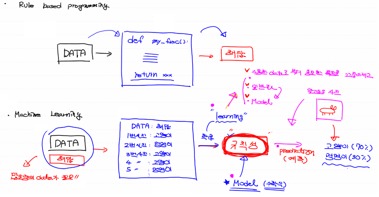
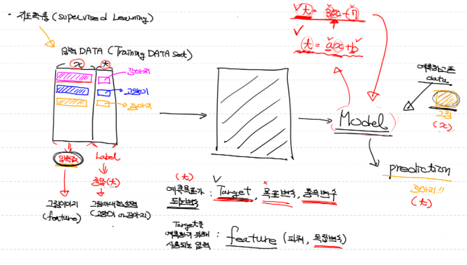
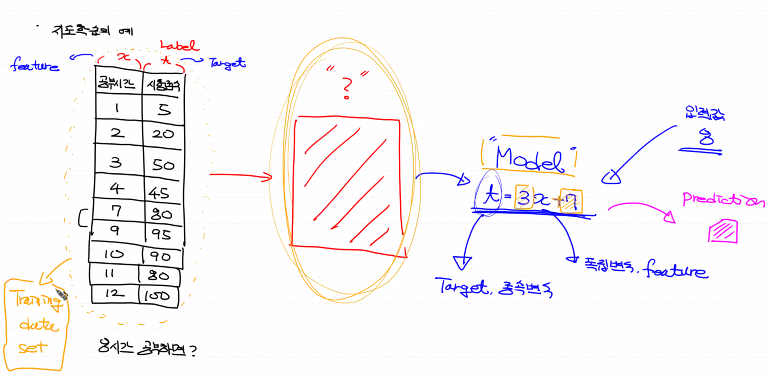

# 머신러닝, 딥러닝

## - AI Introduction


**AI (인공지능)**: 사람의 사고능력을 구현한 시스템, 프로그램.

AI의 연산속도는 사람의 연산속도가 100만배정도 된다고 한다.

- Strong AI: 사람과 구분을 할 수 없을 정도의 강력한 성능의 AI, 우리는 현재 만들 수 없는 단계 어떻게 만들어야 하는지 조차 모르는 수준. 
- Weak AI:  특정한 영역에서 작업을 수행하는 AI, 자율주행, 챗봇, 검색알고리즘 등등


ai를 구현하기 위한 방법중 하나로 Machine Learning이 있다. ML에 대해 알아보기전 기존 Program방식을 생각해보자.

Q. 만약 사진안에 있는 동물이 고양이 인가요? 아니면 강아지 인가요?

- 기존 Program 방식: explicit programming (명시적 프로그래밍), Rull based programming. 지금껏 배웠던 장고에서 request를 보냈을때 키값이나, 어떤 템플릿, 등등이 정해져있는 규칙 Frame work가 있었다. 만약 Q를 해결하기 위해서는 조건이나 규칙이 너무나 많기 때문에 해결하기가 사실상 힘들다.



머신러닝 방식은 조금 다르다. 우리가 규칙을 찾을 수 없기 때문에 컴퓨터에게 맡기게 되며, 이 규칙을 컴퓨터가 찾게 된다. 이 규칙성을 찾아낸 결과를 Model이라고 한다. Data가 많으면 많을 수록 규칙을 더 정확하게 찾고 좋은, 최적의 모델을 만들 수 있다. 그 다음에는 고양이인지 강아지인지 모르는 사진을 모델에 입력해서 결과를 구하는 것이다. 결과는 강아지일 확률과 고양이일 확률로 답을 알려주게 된다.


우리가 흔히 사용하는 3가지 용어

- AI : 가장 포괄적인 개념. 인간의 학습능력 & 추론
- Machine Learning: AI를 구현하기 위한 하나의 방법론. Data를 기반으로 pattern과 특징을 학습해서 미지의 데이터에 대한 추정치를 계산하는 프로그래밍 기법. 머신러닝을 구현하기 위한 방법론으로는 엄청나게 많다. 이 정도는 알아야 한다 싶은 <u>기본</u>적인 기법이 다음과 같다. 굵은 표시는 반드시하고 나머지는 시간이 되면 하겠다.
  - **Regression**
  - **SVM**
  - **Decision Tree**
  - Random Forest
  - Naive Bayes
  - **KNN**
  - **<u>Neural Network</u>**: 다양한 구조와 알고리즘이 존재 => Deep Learning
  - K-Means, DBSCAN (Clustering) - 비지도학습
  - Reinforcement Learning

머신러닝안에 딥러닝이 포함되어 있는데 왜 머신러닝과 딥러닝이라고 할까?

일반적인 머신러닝은 정형적인 Data (Database, CSV, Excel 등)에 잘 맞고, 비정형데이터(이미지, 대용량 텍스트, 소리 등)는 딥러닝에 잘맞다. 무조건 딥러닝이 좋은게 아니란 뜻이다. 물론 딥러닝으로 잘 구현하면 전부다 더 나은 prediction을 얻을 수도있다. 하지만 딥러닝의 최대 단점은 시간이다. 머신러닝은 1분이면 될 수 있지만, 딥러닝은 10시간혹은 그 이상 걸릴수도 있다. 조금의 차이로 많은 시간을 써야하는 것이 손해일 수 있다.


왜 Machine Learning이 필요할까?

=> Rule based programing으로 해결할 수 없는 많은 문제들을 해결하기 위해 등장. 규칙이 너무 많아서 프로그래밍이 안되는 것들. 대표적으로 바둑이 있다.


Machine Learning은 학습방법에 따라 크게 4가지로 부록

- **지도학습 (Supervised Learning)**
- 비지도학습(Unsupervised Learning)
- 준지도학습(Semisupervised Learning)
- 강화학습(Reinforcement Learning)

우리는 지도학습만 할 것이다. 우리가 무슨일을 해도  대부분 지도학습에 대해 할 것이기 때문이다.  지도학습을 제대로 이해하면 지도, 비지도, 준지도학습은 어느정도 할 수 있다. 강화학습은 좀 다르다. 다시 공부해야 한다. 강화학습을 많이 얘기하지 않는 이유는 응용이 그렇게 많지 않다. 일반적으로 금융쪽으로 필요하다고 얘기가 나오고 있다.


지도학습에 대해 얘기해보자.



어떤 입력데이터를 정답과 함께 받는다. 입력값을 feature혹은 독립변수라고 부르고 정답을 Label이라고 한다. feature에는 어떤 이미지값(숫자로변형된)이 들어갈 수 있고, label은 그게 강아지인지 고양이인지 알려주는 것이다. 이렇게 정답이 포함된 여러 데이터들을 정말 많이받아 학습시킨 후 모델을 만들고 그 모델을 통해 예측하는 것이다. 이 목표가 되는 변수를 보통 target이라는 표현을 많이 쓴다. 예를 보자.



어떤 공부시간과 그만큼 했을 때 시험점수에 대한 여러 데이터 셋을 받았다고 하자. 이 데이터셋에 대해서 traning data set이라고 하며, 이를 통해서 학습을 한다. 그리고 그 모델의 예시로 13x-5과 같은 수학식이 나온다고 하자. (실제는 이보다 복잡한 수학식이 나온다) 무튼 이러한 수학식을 통해 어떤 x와 같은 공부시간(독립변수)를 입력했을 때 target값, 시험점수에 해당하는 결과를 도출 시킬 수 있다. 이 모델이 좋으면 좋을 수록 원하는 잘 예측이 가능하다.


지도학습은 모델 완성 후 어떤 종류의 미래값을 예측하느냐에 따라 2가지로 나뉘어진다.

- Regression (회귀)
  - 종속변수(예측값)가 continuous한 value일 때 (사람의 키, 몸무게, 시간)
  - <u>얼마냐</u> 라는 값을 예측
- Classification (분류)
  - 종속변수(예측값)이 discrete한 value일 때 (true or false)
  - <u>어떤 것</u>을 예측
  - 둘중 하나를 선택하는 이항분류(binary)과 다항 분류(multinomial)가 있다.
    - 합격과 불합격은 이항분류
    - 등급을 매기는 A,B,C,D,F 학점은 다항분류라고 할 수 있다.


비지도학습은 하진 않을 것이지만 소개만 해보면 Lable이 없다. 어떤 이미지값 데이터만 넣는다. 그러고 나면 이 데이터를 비슷해보이는 애들끼리 군집화(clustering)한다. 그리고 새로운 데이터가 들어왔을 때 어디쪽에 속하는지 알려준다. 이 사진이 강아지인지 고양이인지는 컴퓨터가 알길이 없지만, 고양이군집에 데이터가 들어갈 것이다.


Machine Learning Process

1. 문제 파악(Domain 분석)
   - 해당 분야의 domain지식을 습득
   - 데이터 분석 방법, 일정 수집
   - 정확도를 측정하는 방법이해
2. 데이터 분석
   - 내부 data만 이용할 것인지, 외부 data도 사용할 것인지
   - EDA, 통계적 데이터 분석(상관분석)
3. 데이터 전처리(Data preprocessing)
   - 모델 학습이 가능한 형태도 data를 정리 (pandas)
   - data분리, 병합
   - 결측치와 이상치 처리
   - binning 처리
   - 자료형 변환
   - 새로운 feature를 추가 or삭제
4. 모델 학습
5. prediction: test data set을 이용해 예측값 도출 -> submission


지도학습에 앞서 미분에 대한 간단한 코드를 보고자 한다. 미분에 대한 내용은 생략하고, 미분계수를 코드상으로 어떻게 구할 수 있는지, jupyter notebook을 통해 확인해보자. 아주 기본이고, 단 변수밖에 해결하지 못하지만 기본이므로 알아보자.

f(x) = x^2 함수를 미분해서 f'(5)를 구해보자.

```python
# 미분을 하고 미분계수를 구하는 함수
def numerical_differentiation(f, x):
    # f는 미분하려는 함수, x는 미분값을 알고자하는 입력값
    delta_x = 1e-4
    result = (f(x + delta_x) - f(x - delta_x)) / (2 * delta_x)
    # 중앙 차분을 이용한 수치미분 = 근사치를 계산
    # 중앙 차분이 근삿값구하는 것중에는 가장 정확하다.
    return result

def my_func(x):
    return x*x

numerical_differentiation(my_func, 5)
------------------------------------------------------------------------------
9.999999999976694 (10과 거의 근사한 값 출력 가능)
```

미분의 정의를 살펴보면 lim가 있는데 이는 코드로 구현할 수 가 없다. x가 0으로 무한히 간다는 것을 코드로 구현할 수 없으므로 적당하게 작은 값을 쓴다. 따라서 1e-4를 이용하였다. 

참고로 파이썬의 경우 1e-8이하로 떨어지면 floating point 오류가 발생한다. 따라서 결과는 정확하고 싶지만 연산에서 오류가 뜰수 있으므로, 쓰지 않는다. 그럼 1e-6은 왜 쓰지 않을까? 써도는 되지만 사람들의 경험상 최적의 값은 1e-4여서 이값을 가져다 쓴다.


다변수 함수의 수치미분 코드도 한번 작성해보자.

f(x, y) = 2x + 3xy + y^3

와 같은 함수가 있다고 해보자. 입력변수가 2개이기 때문에 수치미분을 2번해야 한다.

f'(1.0, 2.0) => (8.0 ,15.0)

```python
import numpy as np

# 수치미분을 수행할 함수, 범용적으로 만들어서 수정할 필요가 없다.
def numerical_derivative(f, x):
    # f: 미분을 하려고하는 함수
    # x: 모든 독립변수의 값을 포함하고 있는 ndarray
    delta_x = 1e-4
    derivative_x = np.zeros_like(x)
    
    it = np.nditer(x, flags=['multi_index'])
    
    while not it.finished:
        idx = it.multi_index
        tmp = x[idx]
        x[idx] = tmp + delta_x
        fx_plus_deltax = f(x)
        
        x[idx] = tmp - delta_x
        fx_minus_deltax = f(x)
        
        derivative_x[idx] = (fx_plus_deltax - fx_minus_deltax) / (2 * delta_x)
        x[idx] = tmp
        
        it.iternext()
        
    return derivative_x
    

# 미분할 함수, 미분할 함수는 다시 만들어야 한다.
# 모든 독립변수가 포함된 인자를 받아서 내부에서 분할해 처리해야 한다.
def my_func(input_value): # [1.0, 2.0]
    x = input_value[0]
    y = input_value[1]
    return 2*x + 3*x*y + y*y*y # np.power(y,3)

result = numerical_derivative(my_func, np.array([1.0, 2.0]))
print(result)
------------------------------------------------------------------------------
[ 8.         15.00000001]
```

f(a, b, c, d) = 2ab + 6a^2bc + 5cd + 2bd^2

함수도 마찬가지로 구해보자. 수치미분을 이용할 함수는 그냥 쓰면 된다.

```python
def my_func2(input_value):
    a = input_value[0,0]
    b = input_value[0,1]
    c = input_value[1,0]
    d = input_value[1,1]
    return 2*a*b + 6*a*a*b*c + 5*c*d + 2*b*d*d

result = numerical_derivative(my_func2, np.array([[1.0, 2.0],
                                                [3.0, 4.0]]))
print(result)
------------------------------------------------------------------------------
[[76. 52.]
 [32. 47.]]
```

프로그래밍할 때 당분간은 수치미분을 구현한 함수를 사용할 것이다.