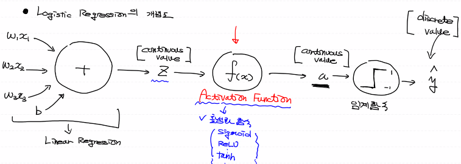

# 머신러닝, 딥러닝

## - Logistic Regression


machine learning model이 어떤 값을 예측하는가에 따라 2가지로 나뉜다고 했다.

- Regression(회귀): Continuous value
- Classification(분류): Discrete value


어떤 점수가 있을 때 이에 해당하는 합격 불합격이 있다고 해보자. 합격과 불합격은 명백한 분류이다. 그 중간이 없다. 

Linear Regression을 확장해서 Classification model을 만들어보자. 이전에 했던 것은 Linear Regression이였다. 이것가지고는 분류문제를 해결할 수 없다. 이 분류문제를 해결하기 위해서 만들어진 것이 Logistic Regression이다.


초창기(1960~1970년) 인공지능 알고리즘중 가장 유명한게 Perceptron이 있다. 이를 발전시킨게 Logistic Regression이다. 자세한 설명은 생략하고 개념도를 보자



y의 결과 값은 discrete value이다. 연속값이 들어가서 최종적으로 이산값을 뽑아내는게 이 모델이다.

어디 부분에 응용할 수 있을까?

- Email spam 판별
- 주식, 채권가격이 상승할지 하락일지
- MRI, CT의료용 사진을 이용한 병의 여부
- 신용카드 사용시 도난카드인지 판단
- 불량품 판단

이런 문제가 많을까? 굉장히 많다. 해결해야하는 대부분의 문제가 분류라고 봐도 무방하다. 정말 압도적으로 많다.

먼저 Activation Function으로 시그모이드부터 사용해보자. 시그모이드를 사용할 경우 그 결과로 나오는 값이 0과 1사이의 실수로 떨어진다.

그다음 임계함수는 0.5보다 크거나 같으면, 그렇지 않으면 0으로 만든다. 그래서 둘 중 하나인 것이다. 이것을 확장하여 여러개중 하나로 바꿀 수 있다.

---

### 실습

mglearn이라는 module을 설치하여 그 안에서 적절한 data set을 가져오자.

anaconda로 data_env로 가서 `pip install mglearn`으로 설치해주자.

```python
import numpy as np
from sklearn import linear_model
import mglearn
import matplotlib.pyplot as plt
# import warnings
# warnings.filterwarnings(action='ignore')
# 이 2줄로 각종 워닝을 무시할 수 있다.

# Training Data Set
x_data, t_data = mglearn.datasets.make_forge()
print(x_data)
# 2차원 ndarray, 2개의 column
# 0번째 column이 x좌표, 1번째 column이 y좌표

print(t_data)
# x_data로 표현되는 좌표평면의 점들이 어떤 값을 가지는지 알려주는 데이터

# plt로 그리기가 힘들다. 그림은 mglearn을 통해 그려서 보자.
mglearn.discrete_scatter(x_data[:,0],x_data[:,1], t_data)
------------------------------------------------------------------------------
[[ 9.96346605  4.59676542]
 [11.0329545  -0.16816717]
 [11.54155807  5.21116083]
 [ 8.69289001  1.54322016]
 [ 8.1062269   4.28695977]
...
 [11.563957    1.3389402 ]]
[1 0 1 0 0 1 1 0 1 1 1 1 0 0 1 1 1 0 0 1 0 0 0 0 1 0]
```


위와 같이 그래프를 볼 수 있다. 1은 세모, 0은  동그라미에 해당한다. 위코드에 이어서 학습도 해보자.

```python
model = linear_model.LinearRegression()
model.fit(x_data[:,0].reshape(-1,1), x_data[:,1].reshape(-1,1))
# x좌표값을 x_data로 y좌표값을 t_data로 하여 학습한다.
# 그래서 이데이터를 가장 잘표현하는 직선으로 표시해보자.
print(model.coef_, model.intercept_)
# 기울기와 절편데이터를 가지고 직선을 그릴 수 있다.

plt.plot(x_data[:,0], x_data[:,0]*model.coef_.ravel() + model.intercept_, color='r')
plt.show()
```


Linear Regression으로 구분하는 데이터를 만들 수가 있다. 이러한 직선을 통해 위 아래로 나누고 위는 1, 아래는 0으로 값을 매기는 것으로 분류를 할 수 있다. 선과 가까울수록 0.5 선과 멀어질수록 0.7~9와 같이 확률도 제공한다.