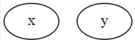

# 제 3고지 - 고차 미분 계산

### - 계산 그래프 시각화


DeZero는 이제 복잡한 수식도 쉽게 코드로 옮길 수 있다. 이런 복잡한 식을 계산할 때 어떤 계산 그래프가 만들어질까, 시각화하면 문제가 발생할 때 그 원인 부분을 찾기가 쉬워진다. 또한 더 나은 계산방법을 찾게 되기도 한다.

여기서는 Graphviz를 활용하여 확인해보도록 하자.

주피터 노트북으로 `conda install graphviz`를 이용해 설치해주자. 설치가 끝나면 터미널에서 dot명령을 사용할 수 있다. 

그 다음은 DOT언어로 그래프를 그려보자. DOT 언어의 기본은 반드시 digraph g{...} 의 구조를 따라야 한다. 예를 들면 다음과 같다.

```python
digraph g{
    x
    y
}
```

그리고 위와 같이 노드는 '줄바꿈'으로 구분해야 한다. 위의 내용을 아무 편집기에 입력한 다음 sample.dot라는 이름으로 저장해주자. 그리고 터미널에서 `dot sample.dot -T png -o sample.png` 명령어를 쳐서 파일의 출력형식을 변경하여 보면 다음과 같은 이미지를 볼 수 있다.



노드에 속성을 지정할 수도 있다.

```markdown
digraph g{
1 [label="x", color=orange, style=filled]
2 [label="y", color=orange, style=filled]
}
```

설명을 하지 않아도 이해할 수 있을 것 같다. 결과 이미지를 보자.


이제 가벼운 계산그래프를 만들어보자. 노드를 추가하고 연결하는 방법은 다음과 같다.

```markdown
digraph g{
1 [label="x", color=orange, style=filled]
2 [label="y", color=orange, style=filled]
3 [label="Exp", color=lightblue, style=filled, shape=box]
1 -> 3
3 -> 2
}
```

이렇게 연결하여 그래프를 나타낼 수 있다. 결과는 다음과 같다.


이제 그래프를 그릴 준비는 다했으니, 이전에 구현했던 DeZero에서 계산그래프를 DOT 언어로 출력하는 기능을 추가해보자.

역전파를 구현하던 논리를 거의 그대로 사용하면 된다. 

DOT언어로 변환하는 `get_dot_graph` 함수를 만들기 이전에 `_dot_var`라는 보조함수부터 구현해보자. 함수앞에 `_` 가 붙은 이유는 이 함수는 `get_dot_graph` 함수 전용으로만 사용할 것이기 때문이다.

```python
def _dot_var(v, verbose=False):
    dot_var = '{} [label="{}", color=orange, style=filled]\n'
    
    name = '' if v.name is None else v.name
    if verbose and v.data is not None:
        if v.name is not None:
            name += ': '
        name += str(v.shape) + ' ' + str(v.dtype)
    return dot_var.format(id(v), name)
```

사용 예시를 보자.

```python
x = Variable(np.random.randn(2, 3))
x.name = 'x'
print(_dot_var(x))
print(_dot_var(x, verbose=True))
```

실행 결과

```python
2131234314376 [label="x", color=orange, style=filled]
2131234314376 [label="x: (2, 3) float64", color=orange, style=filled]
```

위와 같이 `_dot_var` 함수에 넣으면 DOT언어로 작성된 문자열로 바꿔서 반환한다. 변수 노드에 고유한 ID를 부여하기 위해, 파이썬 내장함수인 `id` 를 사용했다.


이어서 DeZero 함수를 DOT언어로 변환하는 편의 함수를 구현해보자.

```python
def _dot_func(f):
    dot_func = '{} [label="{}", color=lightblue, style=filled, shape=box]\n'
    txt = dot_func.format(id(f), f.__class__.__name__)
    
    dot_edge = '{} -> {}\n'
    for x in f.inputs:
        txt += dot_edge.format(id(x), id(f))
    for y in f.outputs:
        txt += dot_edge.format(id(f), id(y())) # y는 약한 참조
    return txt
```

실행 예시

```python
x0 = Variable(np.array(1.0))
x1 = Variable(np.array(1.0))

y = x0 + x1
txt = _dot_func(y.creator)
print(txt)
```

실행 결과

```python
2131233975880 [label="Add", color=lightblue, style=filled, shape=box]
2131233975496 -> 2131233975880
2131233810568 -> 2131233975880
2131233975880 -> 2131233917128
```


이로써 `_dot_var` 함수와 `_dot_func` 함수라는 편의함수를 만들었다. 이를 이용해서 모든 관계도를 기술하는 함수를 만들어보자.

```python
def get_dot_graph(output, verbose=True):
    txt = ''
    funcs = []
    seen_set = set()
    
    def add_func(f):
        if f not in seen_set:
            funcs.append(f)
            seen_set.add(f)
    
    add_func(output.creator)
    txt += _dot_var(output, verbose)
    
    while funcs:
        func = funcs.pop()
        txt += _dot_func(func)
        for x in func.inputs:
            txt += _dot_var(x, verbose)
            
            if x.creator is not None:
                add_func(x.creator)
                
    return 'digraph g {\n' + txt + '}'
```

역전파를 구현할 때의 함수와 거의 유사하다. 하지만 다른 부분이 있다면 역전파는 순서가 중요했지만, 여기서는 순서가 딱히 중요하지 않다 연결이 어떻게 되어있는지만 알면 되기 때문이다. 그래서 heap를 사용한 부분을 제외하였고, return을 txt로 하는 차이이다.

이로써 시각화 코드가 완성되었다.

다만 `get_dot_graph` 함수는 계산 그래프를 DOT 언어로 변환해야 한다. 그런데 DOT 언어를 이미지로 변환하려면 dotㅁ 명령을 수동으로 실행해야 하므로 매번 그렇게 하는 것도 불편한 작업이다. 그래서 dot 명령 실행까지 한번에 해주는 함수를 제공해보고자 한다. 코드는 다음과 같다.

```python
import os
import subprocess

def plot_dot_graph(output, verbose=True, to_file='graph.png'):
    dot_graph = get_dot_graph(output, verbose)
    
    # dot 데이터를 파일에 저장
    tmp_dir = os.path.join(os.path.expanduser('~'), '.dezero')
    if not os.path.exists(tmp_dir): # 디렉토리가 없다면 생성
        os.mkdir(tmp_dir)
    graph_path = os.path.join(tmp_dir, 'tmp_graph.dot')
    
    with open(graph_path, 'w') as f:
        f.write(dot_graph)
    
    # dot 명령 호출
    extension = os.path.splitext(to_file)[1][1:]
    cmd = 'dot {} -T {} -o {}'.format(graph_path, extension, to_file)
    subprocess.run(cmd, shell=True)
```

이제 이 함수들을 모아 utils 라는 모듈안에 넣어두면 나중에 import로 손쉽게 사용할 수 있다.

복잡한 함수중 하나인 glotstein-price 함수를 시각화 해보자.

```python
def goldstein(x, y):
    z = (1 + (x + y + 1)**2 * (19 -14*x + 3*x**2 - 14*y + 6*x*y + 3*y**2)) * \
    (30 + (2*x - 3*y)**2 * (18 - 32*x + 12*x**2 + 48*y - 36*x*y + 27*y**2))
    return z

x = Variable(np.array(1.0))
y = Variable(np.array(1.0))
z = goldstein(x,y)
z.backward()


x.name = 'x'
y.name = 'y'
z.name = 'z'
plot_dot_graph(z, verbose=False, to_file='goldstein.png')
```

실행 결과


이상으로 계산그래프를 시각화 해봤다. 