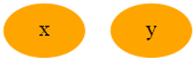

# 제 3고지 - 고차 미분 계산

### - 계산 그래프 시각화


DeZero는 이제 복잡한 수식도 쉽게 코드로 옮길 수 있다. 이런 복잡한 식을 계산할 때 어떤 계산 그래프가 만들어질까, 시각화하면 문제가 발생할 때 그 원인 부분을 찾기가 쉬워진다. 또한 더 나은 계산방법을 찾게 되기도 한다.

여기서는 Graphviz를 활용하여 확인해보도록 하자.

주피터 노트북으로 `conda install graphviz`를 이용해 설치해주자. 설치가 끝나면 터미널에서 dot명령을 사용할 수 있다. 

그 다음은 DOT언어로 그래프를 그려보자. DOT 언어의 기본은 반드시 digraph g{...} 의 구조를 따라야 한다. 예를 들면 다음과 같다.

```python
digraph g{
    x
    y
}
```

그리고 위와 같이 노드는 '줄바꿈'으로 구분해야 한다. 위의 내용을 아무 편집기에 입력한 다음 sample.dot라는 이름으로 저장해주자. 그리고 터미널에서 `dot sample.dot -T png -o sample.png` 명령어를 쳐서 파일의 출력형식을 변경하여 보면 다음과 같은 이미지를 볼 수 있다.


노드에 속성을 지정할 수도 있다.

```markdown
digraph g{
1 [label="x", color=orange, style=filled]
2 [label="y", color=orange, style=filled]
}
```

설명을 하지 않아도 이해할 수 있을 것 같다. 결과 이미지를 보자.




이제 가벼운 계산그래프를 만들어보자. 노드를 추가하고 연결하는 방법은 다음과 같다.

```markdown
digraph g{
1 [label="x", color=orange, style=filled]
2 [label="y", color=orange, style=filled]
3 [label="Exp", color=lightblue, style=filled, shape=box]
1 -> 3
3 -> 2
}
```

이렇게 연결하여 그래프를 나타낼 수 있다. 결과는 다음과 같다.


이제 그래프를 그릴 준비는 다했으니, 이전에 구현했던 DeZero에서 계산그래프를 DOT 언어로 출력하는 기능을 추가해보자.

