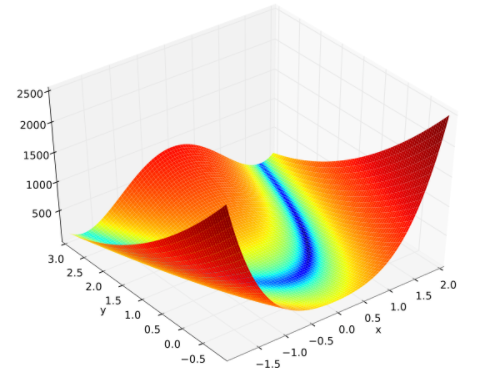

# 제 3고지 - 고차 미분 계산

### - 함수 최적화


DeZero는 이제 미분을 자동으로 계산할 수 있다. 미분은 다양한 용도로 활용되며, 가장 중요한 용도로는 함수 최적화를 들 수 있다. 구체적인 함수를 대상으로 최적화를 해보자. 최적화란 어떤 함수가 주어졌을 때 그 최솟값이나 최댓값을 반환하는 입력을 찾는 일이다. 신경망 학습의 목표도 손실 함수의 출력을 최소화하는 매개변수를 찾는 것이므로, 최적화 문제에 속한다.


로젠브록함수로 예시를 다뤄보자. 로젠브록 함수의 수식은 다음과 같다.

$ y = 100(x_1 - x_0^2)^2 + (1-x_0)^2$

로젠브록 함수는 바나나함수라고도 불리며 보통 최적화 알고리즘을 시험해볼 용도로 사용하는 비볼록함수이다. 함수그림을 보자.



파란부분의 골짜기를 찾는 것이 목적이다.

골짜기는 $x_0, x_1 = 1, 1$ 이다. 이 부분을 DeZero를 사용하여 찾아낼 수 있는지를 확인하자.

먼저 로젠브록 함수의 $x_0, x_1 = 0, 2$ 에서의 미분을 계산해보자 다음과 같이 구현할 수 있다.

```python
def rosenbrock(x0, x1):
    y = 100*(x1 - x0 ** 2) ** 2 + (1 - x0) ** 2
    return y

x0 = Variable(np.array(0.0))
x1 = Variable(np.array(2.0))

y = rosenbrock(x0, x1)
y.backward()

print(x0.grad, x1.grad)
```

실행 결과

```python
-2.0 400.0
```

이렇게 나온 두 미분값은 기울기 또는 기울기 벡터라고 한다. 이 기울기는 각 지점에서 함수의 출력을 가장 크게하는 방향을 가리킨다. 0, 2.0 의 위치에서 -2, 400의 방향으로 움직이면 y값이 가장 커진다는 것이다. 만약 반대로 -를 붙여서 이동하면 y값이 가장 작아지는 방향으로 이동한다.

다만 함수가 복잡하여 local minima같은 부분이 존재한다면 위 방향이 전체의 최솟값이 아닌 국지적 최솟값의 방향을 가리킬 수도 있다. 그래서 방향으로 일정거리만큼 이동한 후 다시 구해보기도 해봐야 하며, 한번에 얼마나 움직일지, 그리고 초기값설정이 얼마나 전체 최솟값 근처에 둘 수 있는지 등에 따라 효율적으로 구할수도 있고, 빠르게 구할수도 있게된다. 이렇게 움직이는 방법이 경사하강법, gradient descent라고 한다.

이 경사하강법을 우리 문제에 적용해보자. 우리는 지금 로젠브록 함수의 '최솟값'을 찾아야 하므로 기울기 방향에 마이너스를 곱한 방향으로 이동하자. 코드는 다음과 같다.

```python
x0 = Variable(np.array(0.0))
x1 = Variable(np.array(2.0))

lr = 0.001  # 일정거리, 얼마나 움직일지
iters = 1000  # 반복 횟수

for i in range(iters):
    print(x0, x1)
    
    y = rosenbrock(x0, x1)
    x0.cleargrad()
    x1.cleargrad()
    y.backward()
    x0.data -= lr*x0.grad
    x1.data -= lr*x1.grad
```

위 코드를 실행시키면 출발점에서 위치가 계속 갱신되는 것을 확인할 수 있다.

실행 결과

```python
variable(0.0) variable(2.0)
variable(0.002) variable(1.6)
variable(0.0052759968) variable(1.2800008)
variable(0.009966698110960038) variable(1.0240062072284468)
...
variable(0.6834917840420289) variable(0.46565059996514135)
```

아직 갱신이 덜 된것 같으니 iters 값을 10000으로 늘려서 실행해보자.

실행결과

```python
variable(0.9944962193480691) variable(0.9890006333530483)
```

원래 목적지가 1, 1이므로 거의다 도착했음을 알 수 있다. 한 50000으로 설정하면 간신히 도착한다. 이를 이용해 로젠브록 함수의 최솟값 위치를 찾았다. 다만 아쉬운점은 50000번의 반복은 상당히 과하다. 더 복잡한 함수에서는 더 많은 반복이 필요할 것이기 때문이다. 실제로 경사하강법은 로젠브록 함수 같은 골짜기가 길게 뺀 함수는 잘 대응하지 못한다. 그래서 다른 최적화 기법을 사용해보려 한다.


경사하강법을 대체할 수 있는 수렴이 더 빠른 방법중 가장 유명한 뉴턴 방법을 이용해보자. 실제로 뉴턴 방법은 위의 경우를 6번의 갱신만에 끝낸다. 50000번이 6번으로 줄어드는 것은 정말 어마어마한 차이라고 할 수 있다. 실제로는 초기값과 학습률의 설정따라 차이가 줄어들고 늘어날 수 있다. 만약 초깃값이 정답에 충분히 가까우면 뉴턴 방법이 더 빨리 수렴한다.

뉴턴방법은 테일러 급수를 활용한다. 테일러 급수를 살펴보자.

$f(x) = f(a) + f'(a)(x-a) + \frac{1}{2!}f''(a)(x-a)^2 + \frac{1}{3!}f'''(a)(x-a)^3 ...$

 위의 식에서

$f(x) = f(a) + f'(a)(x-a) + \frac{1}{2!}f''(a)(x-a)^2$ 에서 멈춘다고 해보자.

f(x)의 근사식을 2차식까지만 구하는 것이다. (2차 근사라고 한다.) 그리고 이 2차 함수의 최솟값을 구해본다면 $x = a - \frac {f'(a)}{f''(a)}$ 의 위치임을 쉽게 알 수 있다. 따라서 a의 위치를 $- \frac {f'(a)}{f''(a)}$ 만큼 갱신하는 것이다. 이 작업을 반복면서 위치를 찾는다. 이 뉴턴 방법을 경사하강법과 비교해보자.

$x  \gets x-\alpha f'(x)$  : 경사하강법 

$x  \gets x-\frac {f'(x)}{f''(x)}$     : 뉴턴 방법 

둘다 x를 갱신하지만, 경사하강법은 우리가 계수를 지정해주고, 뉴턴방법은 자동으로 조정한다. 경사하강법은 1차 미분의 정보만을 활용하고 뉴턴방법은 2차 미분의 정보까지 활용한다고 할 수 있겠다. 뉴턴 미분을 활용하여 구체적인 문제를 풀어보자.

$y = x^4 - 2x^2$ 의 함수를 해보자. 이 함수는 오목한 부분이 2군데 있고, x값이 -1, 1인 위치에 있다. 초깃값을 2로 설정한 후 최솟값중 하나인 x=1에 도달이 가능한지 검증해보자.

다만 안타까운 점으로는 우리의 DeZero가 아직 2차 미분을 자동으로 구현하지 못하여 우리가 직접 구해서 해줘야 한다. 어렵진 않으니 바로 코드로 넘어가보자.

```python
def f(x):
    y = x**4 - 2*x**2
    return y

def gx2(x):
    return 12*x**2-4

x = Variable(np.array(2.0))
iters = 10
for i in range(iters):
    print(i, x)
    
    y = f(x)
    x.cleargrad()
    y.backward()
    
    x.data -= x.grad/gx2(x.data)
```

실행 결과

```python
0 variable(2.0)
1 variable(1.4545454545454546)
2 variable(1.1510467893775467)
3 variable(1.0253259289766978)
4 variable(1.0009084519430513)
5 variable(1.0000012353089454)
6 variable(1.000000000002289)
7 variable(1.0)
8 variable(1.0)
9 variable(1.0)
```

문제의 최솟값 1까지 7회의 갱신만에 도달한 것을 확인할 수 있다. 만약 같은 식을 경사하강법 학습률 0.01로 했을 때 1.0과의 절대 오차가 0.001이하로 떨어지기까지는 124번을 갱신해야 한다.

2차 미분을 자동으로 계산한다면, 좀 더 나은 방법을 DeZero에 만들 수 있는 것이다. 다만 2차 미분에서 끝나긴 아쉬우므로 n차 미분까지 구할 수 있도록 DeZero를 확장해보자.