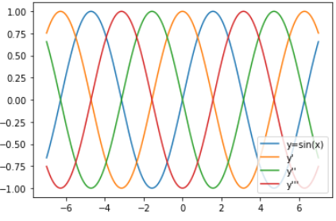

# 제 3고지 - 고차 미분 계산

### - 패키지


지금까지 구현된 부분이 너무 많아 패키지로 정리하고자 한다. 또한 패키지로 정리하고 모듈을 불러서 가져다 쓰면서 좀 더 DeZero의 모양을 구축하고자 한다.

DeZero라는 패키지 내에는 이제 `__init__`, `core`, `utils`, `functions` 등등의 모듈(파이썬 파일)이 들어가게 된다. core클래스로 옮기는 클래스는 Config, Variable, Function, Add, Mul, Neg, Sub, Div, Pow 이다. 가장 핵심의 기능들이고 없으면 아예 진행이 안되는 함수들을 모아넣는다. 이를 이용하여 만든 함수들도 코어파일로 옮기자. 이렇게 하면 이제 외부의 파이썬 파일에서 다음과 같은 코드로 dezero를 import 할 수 있다.

`from dezero.core import Variable` 

그리고 연산자 오버로드를 사용하려면 시작 부분에

`from dezero.core import setup_variable` 으로 함수를 가져오고

`setup_variable()` 함수도 실행시켜주는 것을 잊으면 안된다.


functions 의 모듈에는 sin함수, cos함수를 넣자. 우리가 구현한 DeZero함수를 넣을 곳이다.

utils에는 DOT언어로 그래프 그리는 부분에 대한 함수를 넣을 것이다.

이렇게 넣고 sin 함수 고차 미분을 이어서 해보자.

```python
import numpy as np
from dezero.core import Variable
import dezero.functions as F

x = Variable(np.array(1.0))
y = F.sin(x)
y.backward(create_graph=True)

for i in range(3):
    gx = x.grad
    x.cleargrad()
    gx.backward(create_graph=True)
    print(x.grad)
```

실행 결과

```python
variable(-0.8414709848078965)
variable(-0.5403023058681398)
variable(0.8414709848078965)
```

이렇게 모듈을 가져와서 할 수 있다.


앞의 코드를 조금 확장하여 그래프도 그려보자.

```python
import matplotlib.pyplot as plt

x = Variable(np.linspace(-7, 7, 200))
y = F.sin(x)
y.backward(create_graph=True)

logs = [y.data]

for i in range(3):
    logs.append(x.grad.data)
    gx = x.grad
    x.cleargrad()
    gx.backward(create_graph=True)
    
labels = ["y=sin(x)", "y'", "y''", "y'''"]
for i, v in enumerate(logs):
    plt.plot(x.data, logs[i], label=labels[i])
plt.legend(loc='lower right')
plt.show()
```

실행 결과



여기까지 sin의 테스트를 마친다.


이젠 tanh에 대해서도 해보자. DeZero에 새로이 추가할 함수이다. 하이퍼볼릭 탄젠트 함수의 수식은 다음과 같다.

$y = \tanh(x) = \frac{e^x-e^{-x}}{e^x+e^{-x}}$

함수의 그래프는 다음과 같다.


보면 입력의 결과를 -1부터 1사이의 값으로 반환하는 것을 알 수 있다.

이 함수의 미분 결과는 직접하는 것이 어렵지 않으므로 결과만 말하자면 다음과 같다.

$\frac {\partial\tanh(x)}{\partial x} = 1 - y^2$

이를 참고하면 함수의 구현이 어렵지 않을 것이다.

```python
class Tanh(Function):
    def forward(self, x):
        y = np.tanh(x)
        return y
    
    def backward(self, gy):
        y = self.outputs[0]()
        gx = gy * (1 - y * y)
        return gx
    
    
def tanh(x):
    return Tanh()(x)
```


고차 미분 계산 그래프 시각화를 한번 해보자. 

```python
from dezero.utils import plot_dot_graph

x = Variable(np.array(1.0))
y = F.tanh(x)
x.name = 'x'
y.name = 'y'
y.backward(create_graph=True)

iters = 0
for i in range(iters):
    gx = x.grad
    x.cleargrad()
    gx.backward(create_graph=True)
    
gx = x.grad
gx.name = 'gx' + str(iters + 1)
plot_dot_graph(gx, verbose=False, to_file='tanh.png')
```

iters 값을 키우면서 확인해보자.

그리고 점점 복잡해서 사람이 그리는게 불가능할정도임을 보면서, 마무리한다.


