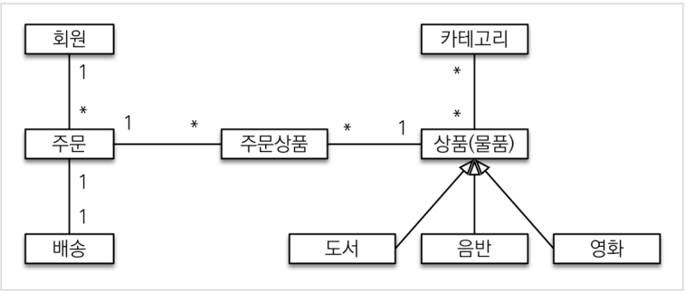

# Domain Design

#### 도메인 모델 

회원은 여러 상품을 주문할 수 있다. 그리고 한 번 주문할 때 여러 상품을 선택할 수 있으므로 주문과 상품은 다대다 관계다. 상품은 여러개 등록될  수 있으므로 상품과 관계는 다대일 관계 등등이 된다.

#### 실제 엔티티

id값은 기본적으로 데이터베이스가 잡아 주는 값으로 자동적으로 있다. Address는 임베디드 타입이다.

자세한 설명은 나중에 정리해서 올리도록 한다.

